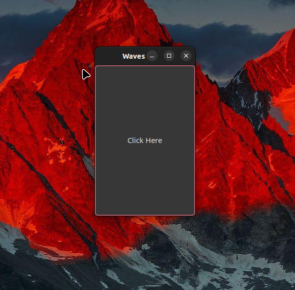

# Waves

> _"Raise your words, not your voice. It is rain that grows flowers, not thunder."_
<br> — Rumi

<!-- img -->
<p>
  
</p>
<!-- Img -->

## Description

Waves is an aid in stuttering therapy, it works by creating an echo of your own voice making your speech linear. Now in GTK!

## Requirements

* Gtk3
* Python3

## Installing dependencies and run

To install dependencies, follow the instructions below.

```$ make install```

To run:

```$ make run```
